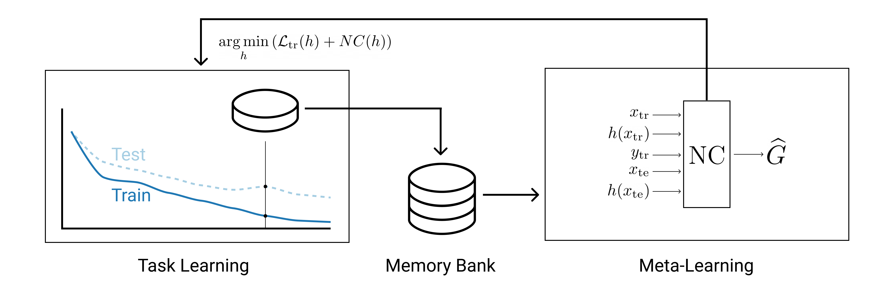
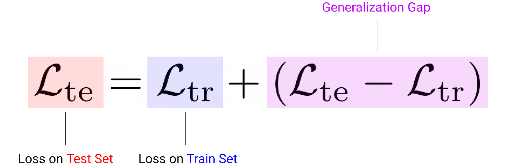

# Neural Complexity Measures

The official repository for the paper [Neural Complexity Measures](https://arxiv.org/abs/2008.02953) (NeurIPS 2020) by Yoonho Lee et al.

<p align="center">

</p>
This work proposes a meta-learning framework for predicting generalization.

<p align="center">

</p>
Neural Complexity (NC) is a neural network which predicts the _generalization gap_ of other networks.


## 1D Regression Experiments
The code inside `1d_regression/` is orgnized as follows.
- `run.py` : Main entry point. Implements MemoryBank and NC's specific training loop. Run with `python run.py --OPTIONS`
- `model/` : Contains definition of the NC network, along with parallelized task learners.
- `data/` : Sinewave data generator


## Citation
If you find this useful in your research, please consider citing our paper:
```
@misc{lee2020neural,
    title={Neural Complexity Measures},
    author={Yoonho Lee and Juho Lee and Sung Ju Hwang and Eunho Yang and Seungjin Choi},
    year={2020},
    journal={arXiv preprint arXiv:2008.02953},
}
```
